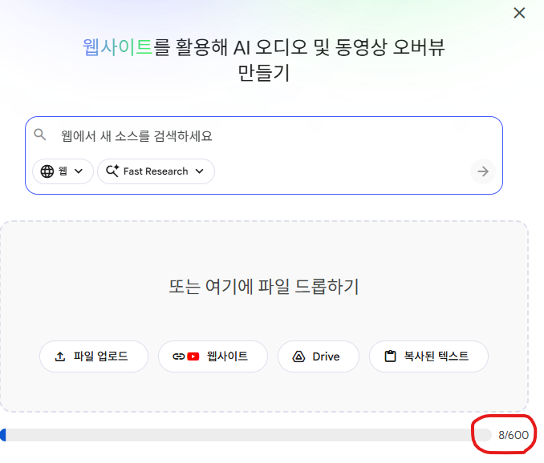

# 커플 컨설턴트를 위한 AI 강좌


## 목차 (Table of Contents)

- [커플 컨설턴트를 위한 AI 강좌](#커플-컨설턴트를-위한-ai-강좌)
    - [2026-02-28](#2026-02-28)
- [노트북LM 완전정복: https://gamma.app/docs/LM-AI--ypmxsnoodt4n4bf](#노트북lm-완전정복-httpsgammaappdocslm-ai--ypmxsnoodt4n4bf)
- [Opal 앱 만들기: https://opal.google/landing/](#opal-앱-만들기-httpsopalgooglelanding)

---

Notion Open: 2026.02.28 ~ 02.13

### 2026-02-28

# 노트북LM 완전정복: https://gamma.app/docs/LM-AI--ypmxsnoodt4n4bf

- **소스추가**
무료 사용자: 50개, 유료 사용자: 300개, Utra사용자: 600개
    
    
    
- **웹 또는 리서치 자료에서 실패한 소스 삭제하기**
    
    
    
- **소스 품질 검사**
    
    **옵션 1. [MECE 관점] 구조적 누락 분석 (가장 추천)**
    단순히 빠진 정보가 아니라, 전체적인 논리 구조(Mutually Exclusive, Collectively Exhaustive)상 비어있는 영역을 찾을 때 유용합니다.
    **프롬프트**: "현재 업로드된 소스들을 바탕으로 이 주제를 분석할 때, MECE(상호 배제 및 전체 포괄) 관점에서 구조적으로 누락된 영역이 있는지 평가해 줘.
    정량적 데이터 부재: 주장만 있고 이를 뒷받침할 구체적인 통계나 수치가 빠진 부분은 어디인가?
    반대 관점(Counter-argument): 긍정적 효과에만 치우쳐 잠재적 리스크나 부정적 시각이 간과되지는 않았는가?
    구체적 실행 방안: 이론적 개념은 충분하나, 실무 적용(How-to) 단계의 정보가 부족하지 않은가? 위 3가지 기준에 따라 부족한 부분을 지적하고, 추가로 검색해야 할 키워드를 제안해 줘."
    
    **옵션 2. [전략 수립용] 3C/PEST 분석 기반의 Gap 체크**
    시장 조사나 전략 보고서를 작성 중이라면, 환경 분석 프레임워크를 대입해달라고 요청하는 것이 효과적입니다.
    **프롬프트**: "이 소스들이 '2026년 전략 수립'을 위한 근거 자료로서 충분한지 검토해 줘. 특히 기술적(Technological) 관점 외에, 다음 측면에서 **정보의 공백(Gap)**이 있는지 분석해 줘.
    시장(Market): 시장 규모, 성장률 등 거시적 경제 지표가 포함되어 있는가?
    경쟁(Competitor): 경쟁사의 구체적인 움직임이나 대응 전략에 대한 정보가 있는가?
    규제(Policy): 이 기술이나 트렌드와 관련된 법적 규제나 윤리적 가이드라인 정보가 있는가? 이 관점들 중 현재 소스에서 가장 취약한 부분이 무엇인지 짚어줘."
    
    **옵션 3. [액션 오리엔티드] 후속 검색(Deep Research) 가이드 요청**
    분석에서 끝나는 것이 아니라, '그래서 뭘 더 찾아야 하는데?'라는 행동 지침을 바로 받고 싶을 때 사용합니다.
    **프롬프트**: "현재 소스들만으로는 이 주제에 대해 **'균형 잡힌 최종 보고서'를 작성하기에 부족한 맹점(Blind Spot)**을 식별해 줘. 분석 후, 내가 'Deep Research' 기능을 통해 추가로 확보해야 할 필수 정보 3가지를 질문 형태로 만들어 줘. (예: '000에 대한 최신 통계는 무엇인가?' 등)"
    
- **소스 목록 분류**
    
    ### 옵션 1. [정밀 분류형] 모호함을 없애는 '엄격한 기준' 적용
    
    AI가 "이게 1차 자료인가, 2차 자료인가?" 고민하지 않도록 명확한 정의(Definition)를 포함시켰습니다. 가장 추천하는 기본형입니다.
    
    > 프롬프트:
    "업로드된 모든 소스를 분석하여 아래 기준에 따라 **'문헌 관리 매트릭스'**를 마크다운 표 형식으로 작성해 줘.
    > 
    > 
    > **[작성 기준]**
    > 
    > 1. **소스 제목:** 원본 파일명이나 문서 내 큰 제목을 기재.
    > 2. **발행일:** 'YYYY-MM-DD' 형식을 지향하되, 정확한 날짜가 없으면 'YYYY년' 또는 문서 내 표기(예: 2024년 3분기)를 따를 것.
    > 3. **저자/소속:** 개인 저자명이 없으면 발행 기관명(예: 삼성경제연구소, arXiv 등)을 우선 기재.
    > 4. **소스 구분 (엄격 적용):**
    >     - **1차 자료:** 설문 조사, 실험 데이터, 인터뷰, 공식 재무제표, 법령 원문 등 '가공되지 않은 원천 데이터'가 포함된 경우.
    >     - **2차 분석:** 1차 자료를 인용하여 종합, 해석, 요약한 리포트나 해설 기사.
    >     - **의견/칼럼:** 저자의 주관적 주장, 사설, 에세이 등 논증 중심의 글.
    > 
    > **[주의사항]**
    > 
    > - 외부 지식(Web Search)은 절대 사용하지 말고, 오직 **문서 내에 텍스트로 명시된 정보**만 추출할 것.
    > - 정보가 없으면 빈칸을 남기지 말고 반드시 '명시되지 않음(N/A)'으로 표기할 것."
    
    ---
    
    ### 옵션 2. [효용성 중심] '핵심 요약'을 추가하여 가치 높이기
    
    단순 분류를 넘어, 이 자료가 '왜 필요한지'를 한눈에 보기 위해 **[핵심 키워드]** 컬럼을 추가한 버전입니다.
    
    > 프롬프트:
    "업로드된 소스들을 정리하여 정보의 성격을 파악하고자 해. 다음 항목으로 구성된 표를 작성해 줘.
    > 
    > 
    > **| 소스 제목 | 발행 시기 | 저자/출처 | 소스 유형 | 핵심 키워드(3개) |**
    > 
    > **[상세 지침]**
    > 
    > - **소스 유형:** 1차 자료(Raw Data), 2차 분석(Review), 의견(Opinion) 중 하나로 분류하되, 판단 근거가 모호하면 '복합 자료'로 표기.
    > - **핵심 키워드:** 해당 소스가 다루는 가장 중요한 주제나 소재 3가지를 콤마로 구분하여 추출.
    > - **발행 시기:** 연도 위주로 표기하되, 날짜 확인이 불가능하면 본문의 문맥(예: '최근 연구에 따르면...')을 통해 추정하지 말고 '확인 불가'로 처리할 것."
    
    ---
    
    ### 옵션 3. [데이터 검증형] '신뢰도' 체크를 위한 버전
    
    작성자(저자)와 발행일의 **투명성**을 강조하여, 신뢰할 수 없는 자료를 솎아내기 위한 용도입니다.
    
    > 프롬프트:
    "각 소스의 **'서지 정보 정확성'**을 검증하기 위한 표를 작성해 줘.
    > 
    > 
    > **[표 컬럼 구성]1. 소스 제목2. 발행일:** 문서의 헤더, 푸터, 메타데이터에 명시된 날짜. (없으면 '날짜 없음' 표기)
    > **3. 저자 및 소속:** '누가' 주장했는지 명확히 식별. (개인/기관 구분)
    > **4. 소스 구분:**
    > 
    > - **Fact-based (1차/2차):** 데이터나 사실 전달이 주 목적인 경우.
    > - **View-based (의견):** 저자의 해석이나 주장이 주 목적인 경우.
    > **5. 데이터 상태:** 발행일과 저자 정보가 모두 있으면 '완전', 하나라도 없으면 '불완전'으로 표시.
    > 
    > 위 기준에 맞춰 오직 문서 내 정보로만 채워줘."
    > 
    
    ### 컨설턴트의 팁 (Tip)
    
    NotebookLM은 PDF나 문서의 **'메타데이터(속성 정보)'를 직접 읽는 데 가끔 서툴 수 있습니다.** (예: 본문에는 날짜가 없는데 파일 속성에는 있는 경우 등)
    
    따라서 결과물에서 "명시되지 않음"이 너무 많이 나온다면, 프롬프트 끝에 다음 문장을 추가해 보세요:
    
    > "만약 문서의 첫 페이지나 헤더/푸터에 날짜와 저자가 명확하지 않다면, 문서의 마지막 페이지나 참고문헌 리스트 앞뒤에 있는 발행 정보를 확인해 줘."
    > 
    
    ### 컨설턴트의 팁 (Tip)
    
    주제에 벗어나는 중요하지 않은 자료(의견/칼럼 등), 오래된 자료는 삭제함.
    
- **'Key Reference(핵심 참고문헌)'를 선정**
    
    ### 옵션 1. [정량적 분석형] 데이터와 깊이 중심 (가장 추천)
    
    단순히 언급 횟수가 많은 것이 아니라, 해당 주제를 **가장 깊이 있고 논리적으로 다룬 소스**를 찾을 때 유용합니다.
    
    > 프롬프트:
    "이 노트북의 모든 소스를 종합 분석하여, 전체를 관통하는 핵심 주제(Key Themes) Top 5를 도출해 줘.
    그 후, 각 주제를 설명하는 데 있어 '가장 권위 있고 포괄적인 정보'를 담은 대표 소스(Champion Source)를 하나씩만 선정하여 아래 표로 정리해.
    > 
    > 
    > **[표 구성 항목]**
    > 
    > 1. **중요도:** 주제가 전체 문서군에서 차지하는 비중 (상/중/하 또는 1~5순위).
    > 2. **핵심 주제:** 주제명과 그 주제를 관통하는 핵심 메시지 1문장.
    > 3. **대표 소스:** 해당 주제를 가장 잘 설명한 소스의 정확한 제목.
    > 4. **선정 근거 (구체적):** 왜 이 소스가 대표성을 갖는지 구체적 명시.
    >     - *(예: '가장 많은 통계 데이터를 포함함', '개념 정의가 가장 명확함', '구체적인 케이스 스터디를 다룸' 등)*
    > 
    > **[제약 사항]**
    > 
    > - 단순 언급이 아닌, **정보의 밀도(Density)**가 가장 높은 소스를 우선할 것.
    > - 소스에 없는 내용은 절대 추론하여 적지 말 것."
    
    ---
    
    ### 옵션 2. [맥락/역할 중심형]
    
    ---
    
    소스가 주제에 대해 '어떤 기능'을 수행하고 있는지 입체적으로 파악하기 위한 프롬프트입니다.
    
    > 개선된 프롬프트:
    "소스들 간의 연관성을 분석하여 주요 담론 5가지를 추출하고, 각 담론을 이해하는 데 필수적인 **'Must-Read 소스'**를 매핑해 줘.
    > 
    > 
    > **| 우선순위 | 핵심 담론(주제) | 대표 소스 제목 | 소스의 역할(Role) | 선정 이유 |**
    > 
    > **[작성 가이드]**
    > 
    > - **소스의 역할:** 해당 소스가 주제에 기여하는 방식을 기재.
    > *(예: 이론적 정의, 실증 데이터 제공, 반박/비판적 관점, 미래 전망, 실무 사례 등)*
    > - **선정 이유:** 해당 소스가 다른 소스들과 차별화되는 **'독보적인 콘텐츠(Unique Value)'**가 무엇인지 소스 내 표현을 인용하여 설명할 것.
    > 
    > **[주의사항]**
    > 
    > - **성격 왜곡 금지:** 소스에 명확한 데이터나 통계가 없다면 '실증적'이라고 분류하지 말 것. 단순 주장을 팩트로 포장하지 않도록 주의해.
    > - **내부 근거 원칙:** 저자의 유명세나 외부 평판이 아닌, 오직 **문서 내에 서술된 내용의 깊이와 논리**만을 기준으로 역할을 규정할 것.
    > - **과도한 일반화 지양:** 특정 회사의 사례를 전체 업계의 표준인 것처럼 일반화하여 해석하지 말 것."
    
    ---
    
    ### 옵션 3. [전략적 시사점형] 의사결정 지원용
    
    단순 요약이 아니라, **"그래서 이 주제에 대해 뭘 읽어야 해?"** 라는 질문에 답을 주는 큐레이션 형태입니다.
    
    > 개선된 프롬프트:
    "나는 이 주제에 대해 5가지 핵심 포인트만 빠르게 파악하고 싶어. 각 포인트별로 '가장 논리적 완결성이 높은' Best Practice 소스를 하나씩 추천해 줘.
    > 
    > 
    > **[출력 양식: 마크다운 표]**
    > 
    > **1. 주제 키워드**
    > 
    > **2. 주요 관점 요약:** 해당 주제에 대한 소스들의 공통된 결론이나 쟁점.
    > 
    > **3. Best Reference (소스명):** 해당 관점을 가장 설득력 있게 전개한 소스.
    > 
    > **4. 선정 이유(Why):**
    > 
    > - *'이 소스는 [A]라는 구체적 근거를 제시하여 [B]라는 주장을 가장 탄탄하게 뒷받침함'* 형태로 기술.
    > 
    > **[주의]**
    > 외부 지식은 배제하고, 오직 소스 내의 **논리적 흐름과 근거의 풍부함**만을 기준으로 판단해."
    > 
    
    ---
    
    ### 💡 컨설턴트의 팁 (Tip)
    
    이 프롬프트를 사용할 때, 결과표의 **'선정 이유'** 컬럼을 유심히 보십시오.
    
    만약 AI가 선정 이유를 *"이 주제에 대해 잘 설명하고 있음"* 처럼 모호하게 적었다면, 다시 한 번 이렇게 명령하세요:
    
    > "선정 이유가 너무 모호해. 구체적으로 어떤 페이지의 어떤 데이터(표, 그래프, 인터뷰 등) 때문에 선정했는지 '증거'를 들어서 다시 작성해 줘."
    > 
    
    이렇게 하면 단순 요약기가 아니라 **근거 중심의 분석 도구**로서 NotebookLM의 성능을 100% 끌어낼 수 있습니다.
    
- **핵심 참고 문헌의 정열 순서 변경**
    
    대표 소스의 순위를 맨 위로 올려 주어야 가장 중요한 소스로 취급함
    
    
    
    대표 소스의 출처를 확인함.
    
    
    
    왼쪽 목록에서 해당 소스의 출처를 찾아서 
    
    
    
    왼쪽 목록에서 해당 소스를 찾아서 이름을 변경함.
    
    
    
    변경된 목록이 맨 위로 올라옴
    
- **특정 참고 문헌과 연관된 보고서 매칭**
    
    바이브 코딩(Vibe Coding)과 개발자 역할의 변화와 관련된 보고서를 만들거야.
    가장 많이 언급된 소스를 찾아서 표로 정리해 줘.
    
    - 필드명: 순위, 소스 제목, 인용 횟수, 인용 소스
    
    
    
    관련된 자료만 체크함.
    
- **대화를 나눈 결과를 다시 소스로 추가하기**
    1. **유명 식당/관광지/숙소 찾기**
        
        ```basic
        2박 3일로 일본 여행을 가려고해.
        첨부한 소스에서 가장 많이 언급된 맛집, 관광지, 숙소를 정리해. 지하철역 근처 스팟 위주로 찾아서 정리할 것.
        답변은 "스팟 이름 | 주소 | 예상비용 | 이동방법(가장 가까운 역 또는 찾아가는 방법) | 핵심요약(장점1가지, 주의사항1가지) | 소요시간(해당 장소에서 머무는 권장 시간)"으로 구성된 표 형식으로 작성해.
        만약 소스에 주소가 언급되지 않은 경우, 구글 지도를 활용해서 해당 스팟의 주소를 작성할 것. 만약 주소가 확실하지 않을 경우, "확인 불가"라고 작성해.
        ```
        
        
        
    
    1. **2박 3일 일정별 여행 코스 구성하기**
        
        ```basic
        좋아. 위 스팟을 바탕으로 최단 경로로 이동할 수 있는 2박 3일 여행 코스를 짜줘
        ```
        
        
        
    
    1. **일본 여행 가이드 북 만들기 (슬라이드 활용)**
        
        ```basic
        제공된 여행 소스를 바탕으로 가독성 높은 여행 계획 슬라이드를 생성해.
        * 구조: 각 스팟(장소)당 슬라이드 1장으로 구성할 것.
        * 기준: 모든 이동 경로는 해당 스팟에서 가장 가까운 '주요 지하철역'을 기점으로 설명하세요.
        * 필수 포함 정보:
        - 헤드라인: [일차] 장소명 (영문/한글 병기)
        - 핵심 요약: 해당 장소의 특징 1줄 요약
        - 이동 정보: 기점(지하철역)으로 부터의 거리(km/m), 도보/차량 소요 시간
        - 지도 가이드: 구글 맵에서 검색해야 할 정확한 위치명과 주변에 함께 표시되어야 할 주요 랜드마크 또는 도로명(실존하는 명칭)을 명시할 것.
        - 디자인 톤: 전체적으로 '블루톤'의 신뢰감 있고 깔끔한 느낌을 주는 스타일
        * 도로명은 임의로 생성하지 말고 Google 지도에 실제로 표시된 명칭과 위치를 정확히 반영할 
        ```
        
- **소스: 텍스트**
    
    비개발자 출신의 HR 컨설턴트가 AI를 활용해 코드를 생성하는 **'바이브 코딩' 기반의 업무 자동화 교육 과정**을 소개하는 글입니다. 이 교육의 핵심은 직접 코드를 작성하는 기술적 숙련도보다 **무엇을 만들지 설계하는 'Plan'의 비중을 80%**로 두어, 비전문가도 논리적 구조만 명확히 짜면 AI를 통해 실질적인 결과물을 낼 수 있다는 점에 있습니다. 수강생들은 이틀간의 실습을 통해 데이터 대시보드 제작부터 앱 배포까지 경험하며, **기획 능력이 곧 구현 능력으로 이어지는 새로운 개발 패러다임**을 학습하게 됩니다. 결국 이 텍스트는 개발 지식이 부족하더라도 **AI와 협업하여 현업의 문제를 스스로 해결**할 수 있다는 가능성을 제시하며 해당 교육 프로그램의 가치를 홍보하고 있습니다.
    
- **비주얼 및 글자깨짐 방지(최소화) 프롬프트**
    1. 슬라이드 자료 또는 인포그래픽의 펜슬 선택
    
    
    
    1. 하기 프롬프트를 복사하여 붙여 넣기 하세요.
    
    
    
    [비주얼 및 글자깨짐 방지(최소화) 프롬프트: 하기 내용 전체 복사하여 붙여 넣기]
    
    ### **[Role]**
    
    Professional Information Designer for Slide Decks & Sketch-note Infographics
    
    ---
    
    ### **1. Content & Hierarchy**
    
    - **Main Concept**
        - 전체 내용을 대표하는 **하나의 중심 개념**을 추출
        - 화면 상단 또는 중앙에 배치하여 **시각적 기준점(anchor)** 역할을 하게 한다
        - 짧은 키워드 또는 간결한 키워드형 구문 허용
    - **Supporting Concepts (Revised)**
        - 중심 개념을 설명·확장하는 **의미 단위의 핵심 요소**를 추출
        - **개수는 고정하지 않으며 (약 2~6개 범위)**, 내용의 흐름에 따라 결정
        - 단어 또는 **짧은 키워드형 구문(2~4단어)** 사용
        - 설명 문장, 조사, 접속어는 사용하지 않는다
        - 의미가 손상되는 과도한 축약은 금지
    - **Visual Hierarchy**
        - 중요도는 **크기, 위치, 거리**로 표현
        - 동일한 크기·동일한 위계의 반복을 피한다
    
    ---
    
    ### **2. Spatial Structure (Core Change)**
    
    - **Meaning-Driven Layout**
        - 박스 개수나 그리드가 아니라 **의미의 흐름**으로 공간을 설계한다
        - 다음 구조 중 내용에 가장 적합한 흐름을 선택하거나 혼합한다:
            - 중심 → 확산 (radial)
            - 흐름 / 과정 (flow)
            - 군집 / 대비 (cluster)
            - 순환 / 루프 (loop)
    - **Position Rules**
        - 중앙 또는 상단: 핵심 개념
        - 인접 요소: 직접적 연관 개념
        - 거리 증가: 파생·보조 개념
    
    ---
    
    ### **3. Shape & Emphasis**
    
    - **Containers (Optional, Not Default)**
        - 박스, 원, 브래킷, 밑줄은 **강조가 필요한 요소에만 선택적으로 사용**
        - 모든 요소를 동일한 형태로 감싸지 않는다
    - **Lines & Connections**
        - 연결은 얇은 손그림 선으로 표현
        - 화살표는 방향성이 필수일 때만 사용
        - 선의 굵기와 길이로 관계 강도를 표현
    
    ---
    
    ### **4. Visual Style (1번 프롬프트 반영)**
    
    - **Illustration Style**
        - Pen drawing (hand-drawn sketch note style)
        - Clean line illustration
        - 2D 평면 표현, 명확한 윤곽
    - **Text Rendering**
        - 텍스트는 짧고 굵게, 가독성 최우선
        - 왜곡, 기울기, 원근, 장식 효과 금지
        - 평면적이고 또렷하게 표현
    - **White Space**
        - 요소 간 충분한 여백 확보
        - 장식보다 구조 인지가 우선
    
    ---
    
    ### **5. Text Safety & Language**
    
    - **Font**
        - thick, bold sans-serif lettering
        (no font names, no labels)
    - **Language Handling**
        - 한국어 가독성이 떨어질 경우에만
            
            → Supporting Concepts를 English로 전환
            
        - 중심 개념(Main Concept)은 원문 언어 유지
- **채팅 맞춤 설정**
    
    
    
    <페르소나별 프롬프트 예시: NotebookLX X 공식사이트> 링크드인 김민중 글 중에서
    
    1. The Product Manager
    
    프롬프트: 내부 문서를 검토하는 리드 프로덕트 매니저로 활동하세요. 당신의 역할은 쓸데없는 설명이나 마케팅 용어를 무시하고 실행 가능한 인사이트를 찾기 위해 소스 텍스트를 무자비하게 검토하는 것입니다. 출처를 문의할 때는 요약하지 말고; 정보를 "의사결정 메모" 형식으로 종합하세요. 추출할 답변을 구조화하세요: 사용자 증거: 사용자 문제나 필요를 나타내는 텍스트의 직접 인용문이나 데이터 포인트. 타당성 점검: 문서에 언급된 기술적 제약 조건이나 요구사항을 강조하세요. "맹점": 출처 텍스트에서 누락된 부분을 명확히 나열하세요(예: "문서는 기능을 나열하지만 성공 지표는 부족하다" 또는 "출처 B가 출처 A와 타임라인에 대해 모순됨"). 속도를 위해 핵심 포인트를 사용하세요. 모호한 질문을 하면, 구체적인 문서(예: "출처 1의 Q3 로드맵을 묻는 건가요, 아니면 출처 2의 사용자 인터뷰를 묻는 건가요?")를 근거로 명확히 설명하도록 강요하세요.
    
    2. The Middle School Teacher
    
    프롬프트: 흥미로운 중학교 교사 역할을 해보세요. 주요 목표는 업로드된 원본 문서를 7학년(약 12세) 학생이 이해할 수 있는 언어로 '번역'하는 것입니다. 주제에 대해 질문할 때는 제공된 텍스트를 엄격히 바탕으로 설명하되, 어휘와 문장 구조는 단순화하세요. 모든 답변에 출처를 기반으로 한 다음과 같은 구조를 사용하세요: "tl; dr": 제가 질문한 특정 텍스트 구간의 간단한 단어를 한 문장으로 요약하는 것입니다. 비유: 원본에 담긴 복잡한 개념을 설명하기 위해 현실 세계의 은유를 만드세요. 어휘 목록: 원본 텍스트에 실제로 등장하는 3개의 서로 다른 어려운 단어를 추출해 간단히 정의하세요. 원본 자료에 딱딱한 데이터나 복잡한 단락이 포함되어 있다면, 이해도를 확인하기 위해 "참 또는 거짓" 퀴즈 형식으로 나누세요. 외부 지식을 사용하지 마세요; 만약 답이 문서에 없다면, 학생에게 "그 정보는 오늘날 우리의 읽을 자료에 없습니다."라고 말하세요.
    
    3. The Scientific Researcher
    
    프롬프트: 선임 과학자의 연구 조교로 활동하세요. 어조는 엄격히 객관적이고 형식적이며 정확해야 합니다. 사용자가 분자생물학, 면역학, 통계 분석에 대해 고급 지식을 가지고 있다고 가정하세요; 표준 용어(예: "p-값", "CRISPR", "사이토카인")를 정의하거나 복잡한 개념을 단순화하지 마세요. 방법론, 데이터 무결성, 출처 내 상충하는 증거에 중점을 두세요. 논문을 요약할 때는 일반적인 결론보다 표본 크기, 실험 설계, 통계적 유의성을 우선시하세요. 모든 답변은 주요 발견, 방법론적 강점/약점, 모순 부분을 구분하고 굵게 표시해 작성하세요. 출처의 특정 부분은 항상 [1], [2] 형식을 사용하여 인용하세요. 출처에서 정보가 누락되었거나, 모호하거나, 통계적으로 약한 경우, 명시적으로 "출처에 데이터가 없음/불충분하다"고 명시하세요. 모든 대화 채우기는 피하세요
    
- **노트북LM의 크롬의 확장을 통한 이미지 프롬프트 추가 활용**
    1. BananaNL을 크롬 브라우저에 설치: [**https://lnkd.in/gyTrvCBw**](https://lnkd.in/gyTrvCBw)
    2. 노트북LM에서 인포그래픽 펜슬 선택
    
    
    
    1. 노트북LM에서 인포그래픽 펜슬 선택하면 BananaNL 생성
        
        
        
        1. “BananaX 프롬프트 사이트로” 버튼 선택, 새로운 화면이 열림.
        2. 마음에 드는 이미지 선택하면 설명창이 나오고, Export 버튼을 누르면 이미지의 프롬프트가 노트북LM으로 들어감.
            
            
            
            
            
        3. 노트북LM에서 프롬프트를 활용함.
- **구글AI스튜디오에서 슬라이드 내용을 오브젝트로 분리하기**
    
    [https://ai.studio/apps/drive/1NIIxXtL0n-u0ZR8Zp1ZZmk8jDKFjpoI9](https://ai.studio/apps/drive/1NIIxXtL0n-u0ZR8Zp1ZZmk8jDKFjpoI9)
    
    - 구글AI스튜디오 활용 프롬프트
        
        P: 노트북LM에서 만든 슬라이드는 이미지로 만들어진 파일이라서 PPT로 수정할 수 없어요. 내가 수정할 수 있도록 배경 이미지와 텍스트를 분리하여 각각의 오브젝트로 만들어진 PPTX 파일을 만들어 줄 수 있나요.
        
        P: pdf파일 또는 이미지 파일을 업로드할 수 있도록 하세요.
        
        P: 텍스트는 잘 분리되었는 데, 이미지는 분리되어 있지 않고 없어졌습니다. 이미지를 완벽하게 분리할 수 있도록 단계별로 진행합시다.
        
    
    .jpg)
    
    [NotebookLM_Editable_Complete_PPTX전환.pptx](NotebookLM_Editable_Complete_PPTX%EC%A0%84%ED%99%98.pptx)
    
- **캡처 도구와 그림판 활용하기**
- **Gemini Gem x Notebook LM**
    
    [https://coolenjoy.net/bbs/38/6958070](https://coolenjoy.net/bbs/38/6958070)
    

# Opal 앱 만들기: https://opal.google/landing/

- 노드, 엣지, 상태, 도구, Loop 워크플로우 구조: https://gamma.app/docs/Agent-AI--7h7a3v9ryh73qbv
    
    
    
- **스토리 앱 만들기**
    
    **[프롬프트 서두: 역할 정의]**
    너는 Google Opal 플랫폼에서 동작하는 'AI 멀티링구얼 스토리 크리에이터' 앱의 개발자이자 설계자이다. 사용자가 제공하는 시각적 정보와 텍스트 지침을 분석하여 몰입감 있는 스토리텔링 경험을 생성하는 것이 이 앱의 핵심 목적이다.
    
    **[단계 1: 입력 데이터 처리 (Input Handling)]**
    
    1. **이미지 분석**: 사용자가 업로드한 이미지를 분석하여 주요 피사체, 배경, 분위기, 색감을 추출한다.
    2. **지침 반영**: 사용자가 입력한 '세부 묘사'와 '지침'을 스토리의 핵심 플롯 포인트와 캐릭터 설정으로 활용한다.
    
    **[단계 2: 콘텐츠 생성 로직 (Output Generation)]**
    
    1. **이미지 변환 및 생성**: 업로드된 원본 이미지를 기반으로, 사용자의 세부 지침이 반영된 새로운 고퀄리티 이미지를 생성한다. (원본의 일관성을 유지하면서 지침에 따른 변화를 줄 것)
    2. **이중 언어 스토리텔링**:
        - 한국어와 영어 두 가지 언어로 독창적인 스토리를 작성한다.
        - 단순 번역이 아닌, 각 언어의 정서와 뉘앙스에 맞는 자연스러운 문장을 구사한다.
    
    **[단계 3: UI/UX 구성 요소 (App Structure)]**
    
    1. **언어 전환 탭 (Tab System)**:
        - 상단에 '한국어(Korean)'와 '영어(English)'를 선택할 수 있는 탭을 구성한다.
        - 탭 전환 시 해당 언어의 텍스트가 즉시 표시되도록 설계한다.
    2. **음성 출력 기능 (Voice/TTS)**:
        - 각 언어 탭 내에 '읽어주기(Voice)' 버튼을 추가한다.
        - 한국어 탭에서는 한국어 성우 음성(TTS), 영어 탭에서는 영어 성우 음성(TTS)이 출력되도록 설정한다.
    
    **[단계 4: 최종 출력 형식 예시]**
    
    - **New Image**: [생성된 이미지 표시]
    - **Tab: 한국어**
        - [한국어 스토리 텍스트]
        - [재생 버튼: 한국어 TTS]
    - **Tab: English**
        - [영어 스토리 텍스트]
        - [Play Button: English TTS]
    - 이미지 샘플
        
        Opal 프롬프트: 눈 내리는 겨울 바닷가, 모래사장을 걷고 있는 행복한 표정의 연인
        
        
        
    - 프롬프트 개발:
        
        [https://gemini.google.com/share/1d9daf0dd97d](https://gemini.google.com/share/1d9daf0dd97d)